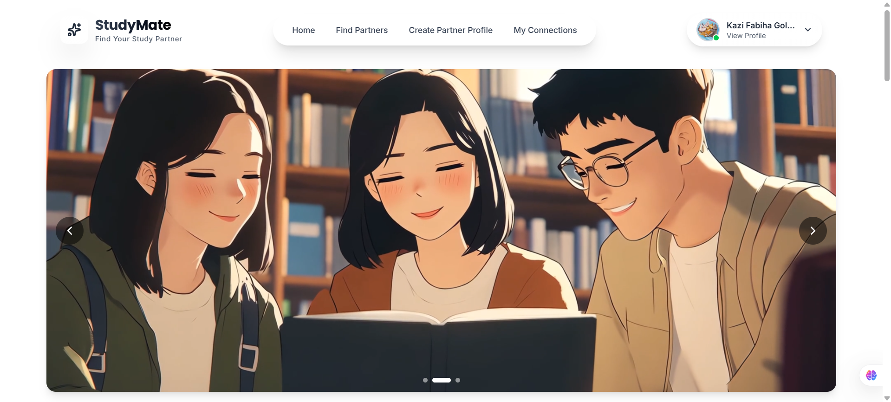
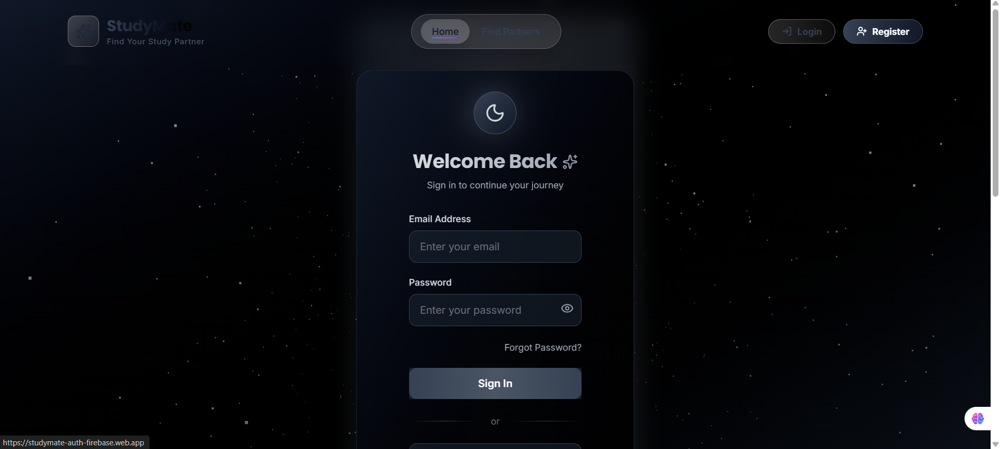
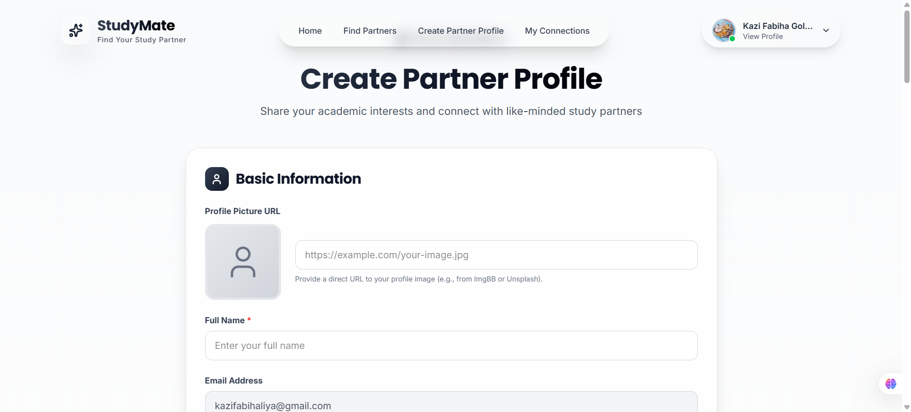
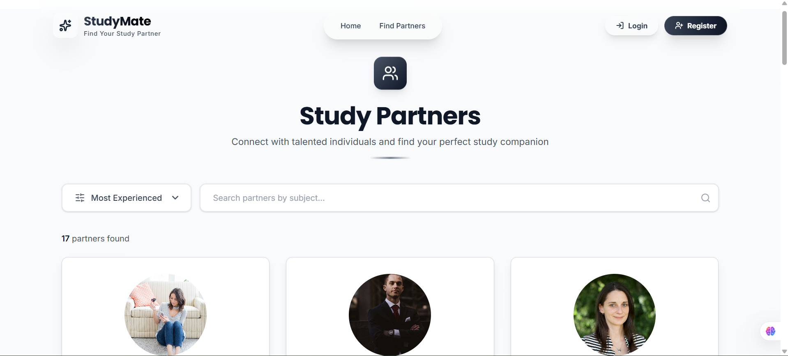
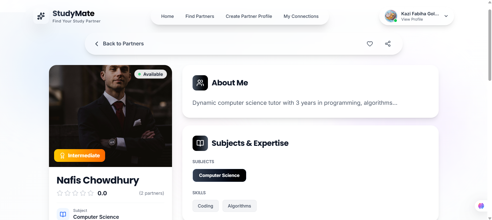
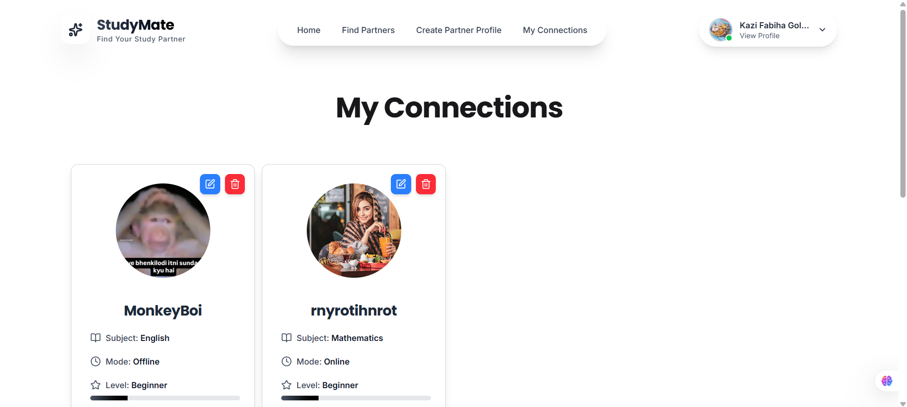

# 🧠 **StudyMate — Find Your Perfect Study Partner**

<p align="left">
  
  
  
  
  
  
</p>

---

## 🌐 **Live Site**

### 🔗 Visit StudyMate → **[https://studymate-auth-firebase.web.app/](https://studymate-auth-firebase.web.app/)**

---

## 📘 **Project Overview**

**StudyMate** is a full-stack MERN platform built to help students connect with ideal study partners based on subjects, interests, experience level, and availability.
The platform focuses on **clean UX**, **frictionless routing**, and **interactive collaboration**—making the study experience smarter and more engaging.

---

## 🚀 **Key Features**

- 🔐 **Firebase Authentication** – Email/password + Google OAuth
- 🔍 **Find Study Partners** – Search & sort profiles dynamically
- ✏️ **Create & Manage Profiles** – CRUD operations with real-time UI updates
- 🤝 **Partner Request System** – Auto-increments partner count using MongoDB `$inc`
- 🌓 **Dark/Light Theme** – Smooth aesthetic toggle
- 📱 **Responsive Layout** – Optimized for mobile, tablet, and desktop
- ⚠️ **Custom 404 Page** – Minimal, animated, user-friendly
- 🎛️ **SweetAlert2 & React Hot Toast** – Clean notifications without default alerts
- 🔁 **Persistent Authentication** – Reloading private routes keeps user logged in

---

## 🧩 **Tech Stack**

### **Frontend**

- React 19, Vite
- TailwindCSS + DaisyUI
- Lucide-React Icons
- React Router 7
- React Hot Toast & SweetAlert2
- Three.js (light 3D visuals)

### **Backend**

- Node.js
- Express.js
- MongoDB + Mongoose
- Firebase Admin SDK

---

## 🔧 **Core Functionalities**

- **User Authentication** (Firebase + Google OAuth)
- **Create Profile** (name, subject, mode, experience, etc.)
- **Find Partners** (search + sort)
- **Partner Details Page** (with request button)
- **My Connections** (update/delete sent requests)
- **Partner Count Increment** using `$inc` operator

---

## 🛠️ **Packages Used**

`firebase`, `lucide-react`, `react`, `react-dom`, `react-hot-toast`,
`sweetalert2`, `three`, `tailwindcss`, `daisyui`, `react-router`, `vite`

---

## 🌍 **Deployment**

- **Client:** Netlify
  🔗 [https://studymate-auth-firebase.web.app/](https://studymate-auth-firebase.web.app/)
- **Server:** Vercel
  🔗 [https://study-mate-server-six.vercel.app/](https://study-mate-server-six.vercel.app/)

---

## 🖼️ **Screenshots**

### Home


### Login


### Create Profile


### Find Partner


### Details Page


### My Connection Page


---

## 🚀 **Quick Setup for StudyMate**

### Prerequisites

- Node.js (v18+), Git, MongoDB Atlas account, Firebase project.

### 1. Clone & Install

```bash
git clone <repo-url> && cd studymate
```

### 2. Backend (server/)

```bash
cd server && npm install
# Create .env: MONGODB_URI=..., FIREBASE_SERVICE_ACCOUNT_PATH=...
npm run dev  # Runs on localhost:5000
```

### 3. Frontend (client/)

```bash
cd ../client && npm install
# Create .env: VITE_FIREBASE_API_KEY=..., VITE_API_URL=http://localhost:5000/api
npm run dev  # Runs on localhost:5173
```

### 4. Test

- Open http://localhost:5173
- Auth (email/Google), create profile, find partners, send requests.

### Troubleshooting

- CORS: Add backend middleware for localhost:5173.
- Env errors: Verify keys/paths.
- DB: Whitelist IP in Atlas.

Deploy: Build frontend (`npm run build`), upload to Netlify; backend to Vercel. Email dev for help!
Package: Run (`npm i`) in your CMD to install all the needed packages. 

---

## 👩‍💻 **Developer Info**

**Name:** Kazi Fabiha Golam Liya
**Email:** [kazifabihaliya@gmail.com](mailto:kazifabihaliya@gmail.com)

---

### _“StudyMate — Learn better together.”_

---
